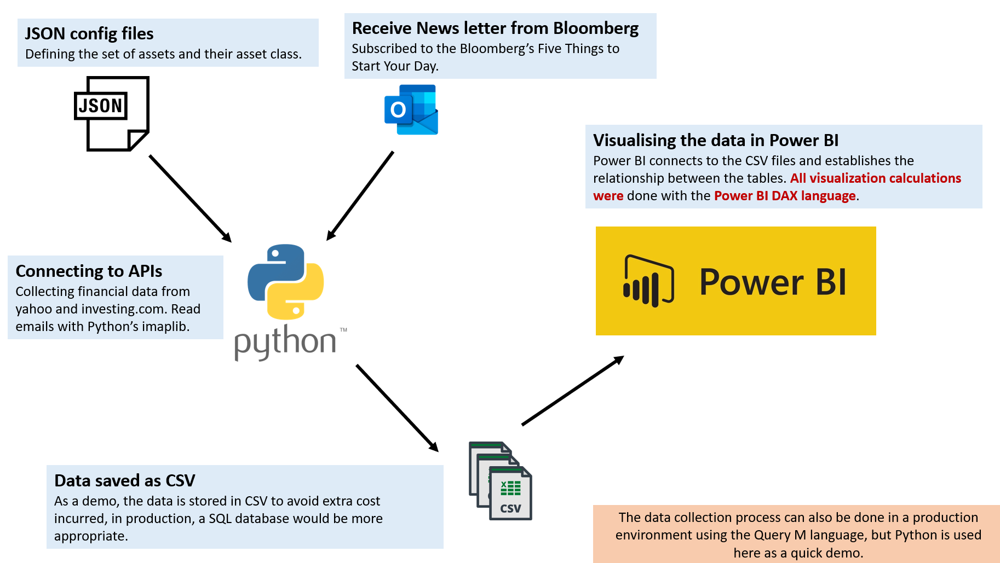

# Power BI dashboard highlight

**Project architecture**

 

---

 

**Rationale For This Project**

This is an approximate replicate of one of many dashboards I built at work. I aimed to visualize all the important market information in a single dashboard while allowing us to generate charts for daily reporting quickly. 

To better leverage the market reports we write and send via email daily, I was asked to incorporate the text into the dashboard, which is not natively supported in Power BI. Back then, I had to write a Python script to fetch our report from Outlook and parse the email HTML into a table of text. Since I don’t work in the bank anymore, I have decided to utilise my Bloomberg subscription by parsing the “Five things to start your day” daily newsletter. A sentiment score between -1 to 1 is also calculated on the news headline. 

**Design decisions**

**Q: Why use Python for data collection?**

**A:** While it is possible to call APIs using Query M in Power BI, there are some tasks we can only do in Python, such as sentiment calculation and parsing HTML text from emails. Nevertheless, if I were to simply build a dashboard with market data, I would have picked Query M. The main advantage is that Query M can be natively run on the Power BI server (both public cloud and on-premise reporting server), allowing for on click data refresh which is not possible in Python.

**Q: How did you do the calculation for the price changes?**

**A:** Coming from a Python background, the calculation with Query M and DAX are indeed quite restrictive. However, using Python would defeat the whole purpose of using Power BI. In this project, I have used DAX to compute the changes progressively, meaning I first define easier measurements such as the previous price and utilise the measurement for more complex calculations.

**Q: Why use CSV and not SQL database?**

**A:** There are a few reasons.

1. CSV is easy to work with.
2. Using CSV allow the data to be stored directly in my Power BI workspace.
3. Hosting an SQL database is too troublesome for a demo.

Having said that, SQL is definitely the better choice in a production environment.

 

---

 
